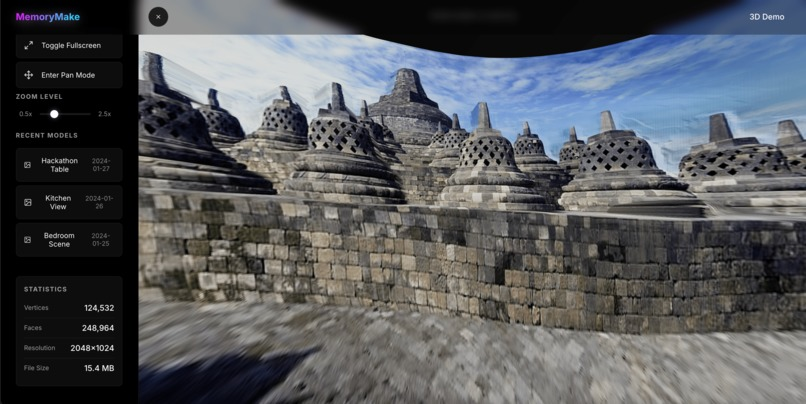
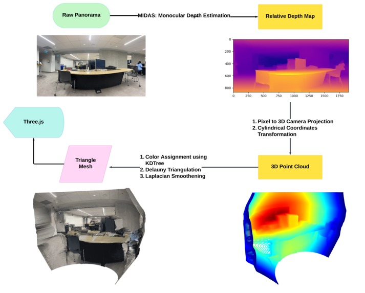
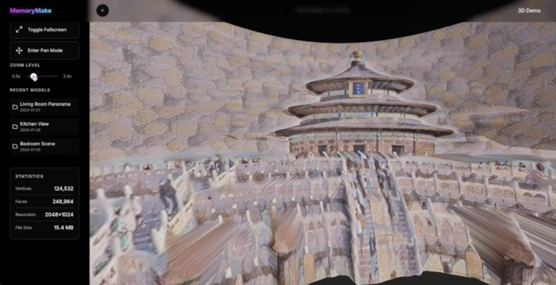
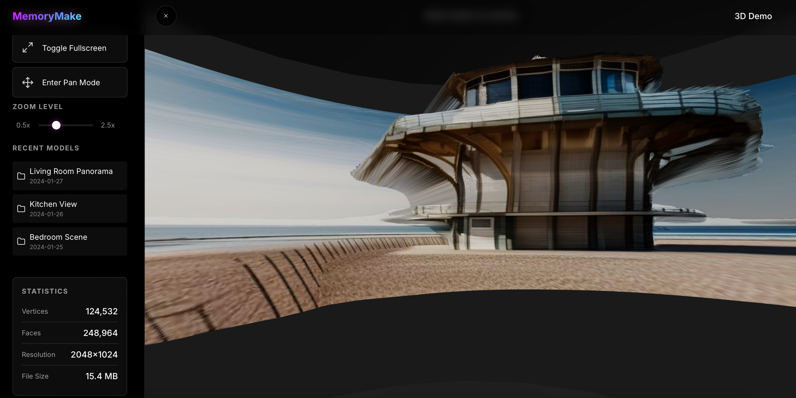

# MemoryMake

As memories pile up in our camera rolls or remain abstract ideas, we wanted to create a way to truly experience them. MemoryMake was born from the idea of transforming ordinary photos and text prompts into dynamic, navigable, and visually engaging 3D environments—so users can explore their cherished moments instead of merely scrolling past them.



We developed **our own** efficient 3D model generation pipeline, which takes in a panorama image and returns a 3D model that can be viewed in a 180-degree environment, leveraging cutting edge computer vision and generative AI research.



In a society where everyone is constantly thinking about going forwards, we wanted an opportunity to appreciate our memories and live in them once again.

> This is a project submitted to Qhacks 2025, learn more [at our Devpost](https://devpost.com/software/memorymake)

## Demo

View the demo on [YouTube](https://youtu.be/Lyfvt5-SsFA)

## Tech Stack + Features

- 3D Model Generation: Our backend uses **MiDaS monocular depth estimation**, developed at Intel labs, combined with **Open3D** mesh generation, and our custom algorithm to turn point-clouds to cylindrical coordinates to recreate a 180 degree view of the scene.

- 180 Degree View: The 3D model is returned to the frontend, where you can zoom, pan, and navigate around your memory using **Three.js**. You can easily browse through collections and navigate inside the 3D environment.

- Style Selection: Choose from artistic styles like Photorealistic, Monet, or Van Gogh, which will overlay onto a realistic place that you upload using **Neural Style Transfer**.



- Text-to-3D: Don't have a panorama? You can also input text prompts, which will be converted into a 3D environment using **Stable Diffusion** for text-to-image generation.



## References

- MiDaS: [https://arxiv.org/pdf/1907.01341v3](https://arxiv.org/pdf/1907.01341v3)
- Neural Style Transfer: [https://arxiv.org/pdf/1508.06576.pdf](https://arxiv.org/pdf/1508.06576.pdf)
- Stable Diffusion: [https://arxiv.org/pdf/2112.10752](https://arxiv.org/pdf/2112.10752)
- CycleGAN: [https://arxiv.org/pdf/1703.10593](https://arxiv.org/pdf/1703.10593)

## Usage

Start React frontend:

```bash
cd frontend
npm install
npm run dev
```

Start FastAPI backend:

```bash
cd backend
uvicorn main:app --reload
```

For image generation, you will require the Hugging Face inference API key in a `.env` file in the backend directory. However, since the model is open-source, you can also modify the code to download the weights and run it locally.

> All the models used in this project are open-source and free to use.
